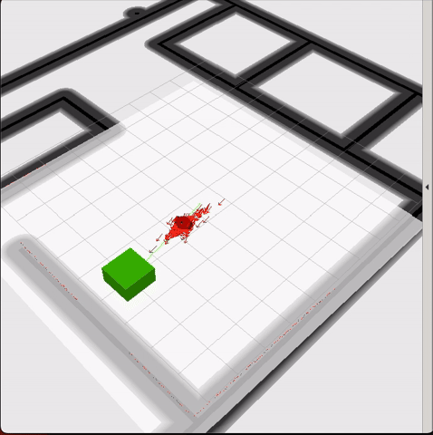

# Home Service Robot Final Write-Up

This project is the final project in Udacity's Robotics Software Engineer Nanodegree. In this project, I combined the skills learned throughout the program to build a robot that can navigate through a virtual world, pick up a virtual object, and deliver it to a designated drop-off location.

    
     Home Service Robot

## Robot and World

I designed both the robot and the world in Gazebo. The robot includes a Hokuyo LiDAR sensor and a RGB camera, which provide feedback used for localization and navigation. The world is based on an open office environment, and I created a 2D occupancy grid map of that environment for use in SLAM and navigation.

## Package Setup

### `home_service`
This package contains the main project setup and supporting files.

- **World files**: define the Gazebo world and robot environment
- **Launch files**:
  - `world.launch`: launches the world and spawns the robot
  - `amcl.launch`: launches Adaptive Monte Carlo Localization for robot localization in the map
  - `view_navigation.launch`: opens RViz to visualize navigation, localization, and markers
- **Scripts**: shell scripts used to launch the full project workflow more easily
- **Config files**: parameter files used to tune localization and navigation behavior

### `add_markers`
This package contains the C++ node that publishes a virtual marker in RViz. A green marker appears at the pickup location. Once the robot reaches the pickup zone, the marker disappears to simulate pickup. When the robot reaches the drop-off location, the marker reappears to simulate delivery.

### `pick_objects`
This package contains the C++ node that sends navigation goals to the robot. These goals direct the robot first to the pickup location and then to the final drop-off location.

## ROS Packages Used

This project uses several core ROS packages for mapping, localization, and navigation.

### `slam_gmapping`
The `slam_gmapping` package was used earlier in the project to create a 2D occupancy grid map of the environment. It uses laser scan data and odometry to perform SLAM, allowing the robot to build a map while estimating its position.

### `map_server`
The `map_server` package loads the saved occupancy grid map so it can be used later for localization and navigation. It reads the map image and metadata from the map files and publishes the map to the rest of the ROS system.

### `amcl`
The `amcl` package provides Adaptive Monte Carlo Localization. It uses the saved map, laser scan data, and odometry to estimate the robot’s pose within the environment. This allows the robot to determine where it is while navigating.

### `move_base`
The `move_base` package is responsible for autonomous navigation. It receives goal positions, plans a path to the target, and sends velocity commands to the robot while avoiding obstacles.

### `rviz`
`RViz` is used to visualize the robot, map, localization, navigation goals, and marker behavior during the simulation.

## Project Outcome

The final result of this project is a fully autonomous home service robot operating in a virtual Gazebo environment. The robot is able to localize itself within a known map, navigate to a pickup location, simulate picking up an object by removing the marker in RViz, and then navigate to a drop-off location where the marker reappears.

This project demonstrates the integration of mapping, localization, path planning, and visualization tools within ROS. It brings together the major concepts covered throughout the Nanodegree into a single working robotics system.

